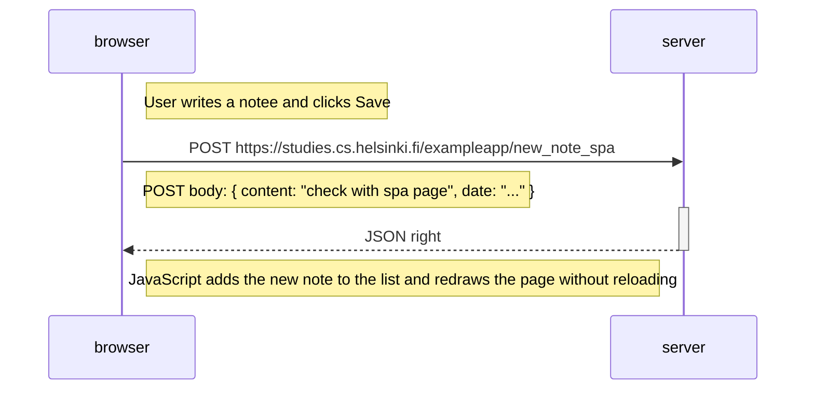

```mermaid
  sequenceDiagram
    participant browser
    participant server

    Note right of browser: User writes a notee and clicks Save

    browser->>server: POST https://studies.cs.helsinki.fi/exampleapp/new_note_spa
    Note right of browser: POST body: { content: "check with spa page", date: "..." }
    activate server
    server-->>browser: JSON right
    deactivate server

    Note right of browser: JavaScript adds the new note to the list and redraws the page without reloading
```